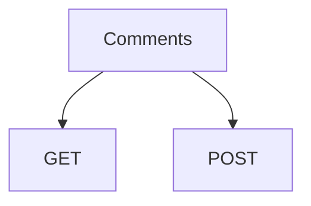

# Requirements

For the Posts service to run you need to install dependecies to your <SwmPath>[comments/](/comments/)</SwmPath> folder:

- <SwmToken path="/comments/index.js" pos="2:2:2" line-data="const express = require(&quot;express&quot;);">`express`</SwmToken>
- <SwmToken path="/comments/index.js" pos="3:2:2" line-data="const cors = require(&quot;cors&quot;);">`cors`</SwmToken>
- <SwmToken path="/comments/index.js" pos="4:2:2" line-data="const axios = require(&quot;axios&quot;)">`axios`</SwmToken>

&nbsp;

If you are not in the posts folder, go to the posts folder

> cd comments

Rum command

> npm i&nbsp;

# Starting service

If you are not in the posts folder in you terminal, go to the posts folder

> cd comments

Run command

> npm start

You should now see in the terminal

> \\> comments@1.0.0 start
>
> \\> nodemon index.js
>
> \[nodemon\] 3.1.10
>
> \[nodemon\] to restart at any time, enter `rs`
>
> \[nodemon\] watching path(s): *.*
>
> \[nodemon\] watching extensions: js,mjs,cjs,json
>
> \[nodemon\] starting `node index.js`
>
> Comment Service is running on <http://localhost:5001>

# Two main API functionalities

- Post a comment on existing post
- Get comments of a existing post



<SwmSnippet path="/comments/index.js" line="9">

---

Array for holding comments

```javascript
const postComments = [];
```

---

</SwmSnippet>

## Making a Comment

&nbsp;

## Getting Comments

&nbsp;

<SwmMeta version="3.0.0" repo-id="Z2l0aHViJTNBJTNBYmxvZyUzQSUzQWFsZWtzYW5kZXJ0YXA=" repo-name="blog"><sup>Powered by [Swimm](https://app.swimm.io/)</sup></SwmMeta>
