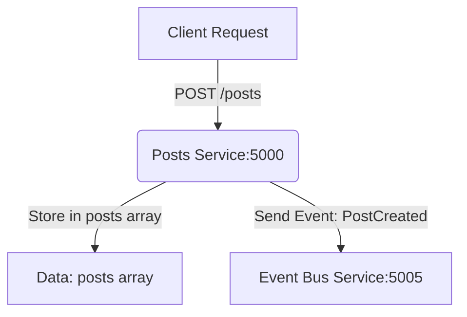

# 1\. Project Setup and Dependencies

For the Posts service to run, you need to install the following dependencies in your project's root folder <SwmPath>[posts/](/posts/)</SwmPath>

- <SwmToken path="/posts/index.js" pos="1:9:9" line-data="const express = require(&quot;express&quot;);">`express`</SwmToken> - The core web framework.
- <SwmToken path="/posts/index.js" pos="2:2:2" line-data="const cors = require(&quot;cors&quot;);">`cors`</SwmToken> - Enables Cross-Origin Resource Sharing.
- <SwmToken path="/posts/index.js" pos="3:2:2" line-data="const axios = require(&quot;axios&quot;);">`axios`</SwmToken> - HTTP client used to send events to the Event Bus.

If you are not in the posts folder, go to the posts folder

> cd posts

Run installation command

> npm i&nbsp;

# 2\. Starting service

o start the service using nodemon (for automatic restarts during development), use the npm start script defined in your <SwmPath>[posts/package.json](/posts/package.json)</SwmPath>.

If you are not in the posts folder in you terminal, go to the posts folder

> cd posts

Run command

> npm start

You should now see in the terminal

> \\> posts@1.0.0 start
>
> \\> nodemon index.js
>
> \[nodemon\] 3.1.10
>
> \[nodemon\] to restart at any time, enter `rs`
>
> \[nodemon\] watching path(s): *.*
>
> \[nodemon\] watching extensions: js,mjs,cjs,json
>
> \[nodemon\] starting `node index.js`
>
> Posts Service is running on <http://localhost:5000>

# **3. Service Architecture & Flow**

The Posts service is a key component in our Event-Driven Architecture. Its primary job is not just to store data, but to announce when new data is created.



# 4\. API Endpoints

This service provides two main API functionalities: creating a new post and retrieving all posts. The data is currently stored in the in-memory <SwmToken path="/posts/index.js" pos="11:2:2" line-data="const posts = [];">`posts`</SwmToken> array.

<SwmSnippet path="/posts/index.js" line="11">

---

Array for holding post objects

```javascript
const posts = [];
```

---

</SwmSnippet>

## 4.1 POST /posts: Making a Post

<SwmSnippet path="/posts/index.js" line="17">

---

This endpoint handles both the creation of the post and the critical step of emitting an event to <SwmPath>[event-bus/index.js](/event-bus/index.js)</SwmPath>.

```javascript
app.post("/posts", (req, res) => {
  try {
    const title = req.body.title;
    const id = (posts.length + 1).toString();
    const post = {
      id: id,
      title: title,
    };
    posts.push(post);
 
    axios.post("http://event-bus-service:5005/events", {
      type: "PostCreated",
      data: post,
    }).catch((error) => {
      console.log(error);
    })

    res.status(201).json({ post: post, message: "Post created successfully" });
  } catch (error) {
    console.error("Error creating post:", error);
  }
});
```

---

</SwmSnippet>

### 4.1.1Request Example

Url: <localhost:5000/posts>

Method: POST

Request body (raw)

```json
{
    "title": "Making first post"
}
```

Response: 201 Created

## 4.2 GET /posts: Getting all Posts

<SwmSnippet path="/posts/index.js" line="13">

---

This endpoint simply returns the current contents of the in-memory array.

```javascript
app.get("/posts", (req, res) => {
  res.json({ posts: posts });
});
```

---

</SwmSnippet>

### 4.2.1 Request Example

Url <localhost:5000/posts>

Method: GET

Response

```json
{
    "posts": [
        {
            "id": "1",
            "title": "Making first post"
        }
    ]
}
```

# 5\. Event Reception Placeholder

<SwmSnippet path="/posts/index.js" line="40">

---

This service also exposes an endpoint to receive events from the Event Bus, though it currently does not process them.

```javascript
app.post("/events", (req, res) => {
  res.json({});
});
```

---

</SwmSnippet>

<SwmMeta version="3.0.0" repo-id="Z2l0aHViJTNBJTNBYmxvZyUzQSUzQWFsZWtzYW5kZXJ0YXA=" repo-name="blog"><sup>Powered by [Swimm](https://app.swimm.io/)</sup></SwmMeta>
